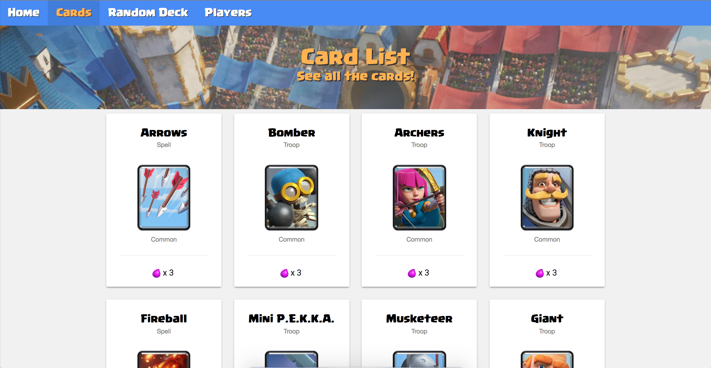
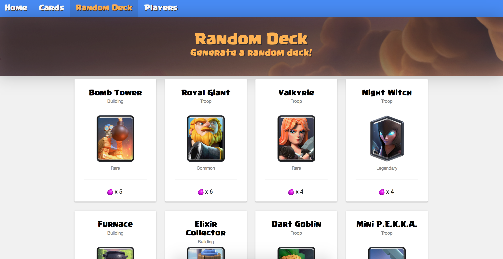

# Royal Deck Creator

This is intended to be a Clash Royale deck maker - so far it we can:

1. Get a nice list with all the cards of the game and details about it.

2. Info about Arena and King Towers. (Damage speed etc);
3. Generate a random deck

### TODO:
- Add a new view so users are able to create a new deck, picking cards and then saving it.
- Login system.
- A deck and card voting system.
- Refactor `api` so we can use it later, when build the app for iOS and Android.

### Play with it
You can see it running live at [https://royaledecks.herokuapp.com/](https://royaledecks.herokuapp.com/) - (this is running on a free server, so it may take a while to load.)

You can also clone this repository and run it with:

`$ git clone https://github.com/AndreVarandas/royale.git`

`$ npm install && npm start`

#### Credits to [Martin Carrera](https://github.com/martincarrera)
For building the api, you can check it out [here](https://github.com/martincarrera/clash-royale-api).

#### Important Notice
This content is not affiliated with, endorsed, sponsored, or specifically approved by Supercell and Supercell is not responsible for it. For more information see Supercell’s Fan Content Policy: [www.supercell.com/fan-content-policy](www.supercell.com/fan-content-policy).

[LICENSE - MIT - André Varandas](LICENSE)